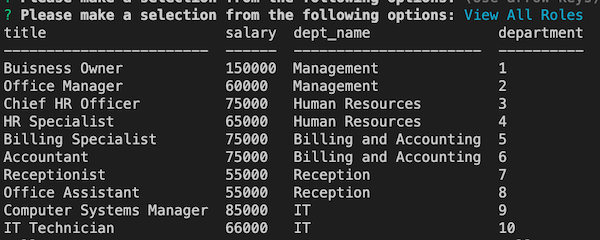
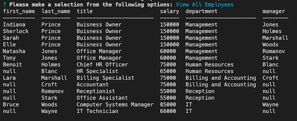

# Employee Tracker App

## Description

Command Line CMS Interface Application to manage a company's employees database. 

### User Story

* AS A business owner
I WANT to be able to view and manage the departments, roles, and employees in my company SO THAT I can organize and plan my business

## Table of Contents

- [Objectives](#objectives)
- [Assets](#assets)
- [Installation](#installation)
- [Walkthrough Video](#walkthrough)
- [Github Link](#github-link)

## Objectives

When creating a company command line CMS interface, I want my application to meet the following requirements

* WHEN I start the application
THEN I am presented with the following options: view all departments, view all roles, view all employees, add a department, add a role, add an employee, and update an employee role
* WHEN I choose to view all departments
THEN I am presented with a formatted table showing department names and department ids
* WHEN I choose to view all roles
THEN I am presented with the job title, role id, the department that role belongs to, and the salary for that role
* WHEN I choose to view all employees
THEN I am presented with a formatted table showing employee data, including employee ids, first names, last names, job titles, departments, salaries, and managers that the employees report to
* WHEN I choose to add a department
THEN I am prompted to enter the name of the department and that department is added to the database
* WHEN I choose to add a role
THEN I am prompted to enter the name, salary, and department for the role and that role is added to the database
* WHEN I choose to add an employee
THEN I am prompted to enter the employee’s first name, last name, role, and manager, and that employee is added to the database
* WHEN I choose to update an employee role
THEN I am prompted to select an employee to update and their new role and this information is updated in the database

## Assets

* MySQL2
* Inquirer
* console.table 
* npm 

## Installation

* Clone the repository
* run - $ npm install - in command line
* run - $ nodemon server - to start the server 

## Walkthrough Video

* [Demo Video](https://drive.google.com/file/d/1UD1CXwzqh_RpVBFxndWWQ95dMLt1erfG/view)

## Screenshots

All Roles 

All Employees

All Departments 

## Github Link

Click here for the link to my [Github Respository](https://github.com/Gdebortoli/antzOnaLog.ET.12.gd) 